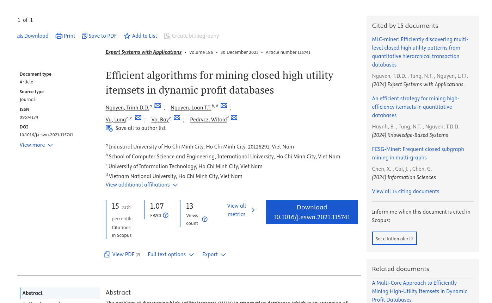
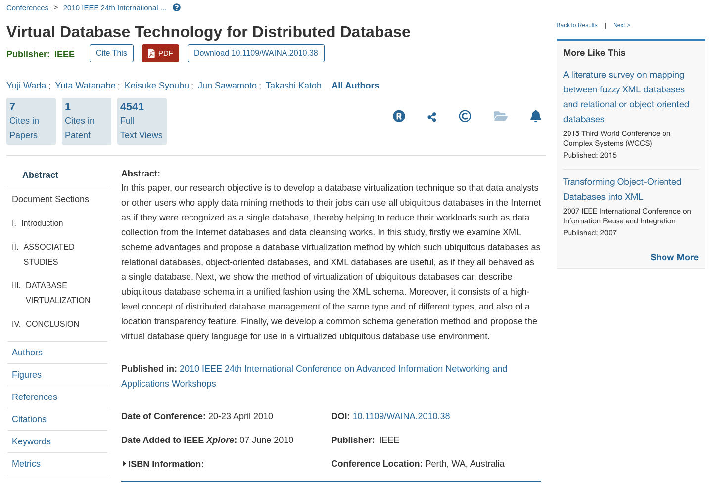

  

    

    <em>Chrome extension for academic piracy designed to improve researchers' workflows</em>

Tired of searching for research articles that are ultimately unavailable on Sci-Hub?. We have a tool designed for your needs. Is it on Sci-hub is a Chrome extension that does a DOI-Based search to enable a download button in your research database.

## Scopus

  

## IEEExplore

  

# Install

- Clone repo
- Open the Chronium browser of your preference
- Go to [Extensions](chrome://extensions)
- Load Unpacked Extension